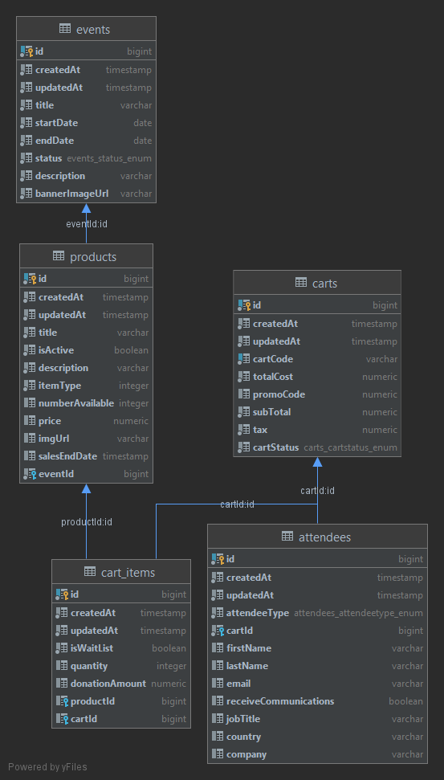
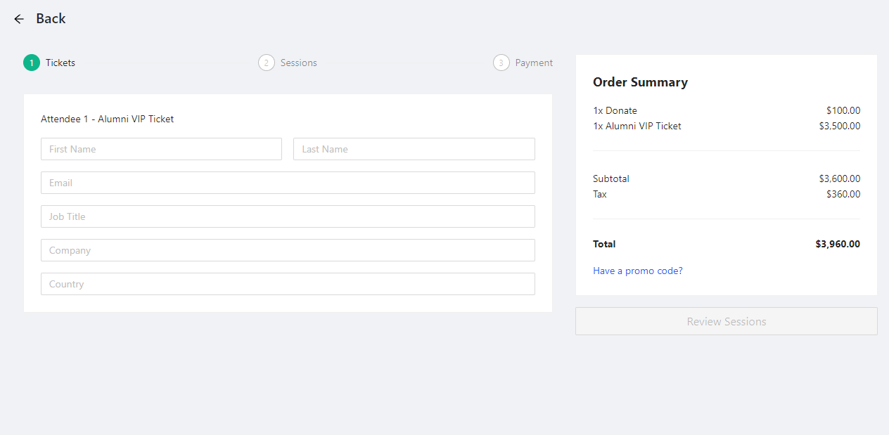

# Events Assignment
This is deliverable for assignments

## Prerequisites:
* PostgreSQL (>10)
* NodeJS
* Angular `@angular/cli`

# Database Design

# Database Management
- database is generated using TypeORM, using the commands below
- Generate migration
- `cd api && npm run migration:generate migrationname`
- Run the migration
- `cd api && npm run migration:run`
- Create the product seeds
- `cd api && npm run seed:run`

# API Documentation
API documentation with sample is available on [Postman](https://documenter.getpostman.com/view/574536/UUy39SPQ)

# User Interface
- 1- View event detail page
 

- 2- Register an event

# Setting up development environment
## Set up API:
- cd api
- Configure environment variables `cp .env.example .env`
- Create migration `npm run migration:generate base`
- Run migration `npm run migration:run`
- Run seed `npm run seed:run`

## Run Server
- in `api` folder run `npm run serve`

## Many thanks:
Many thanks for [Tien Nam Pham](https://github.com/tiennampham23/nodejs-angular-typescript-boilerplate) for providing boilerplate
